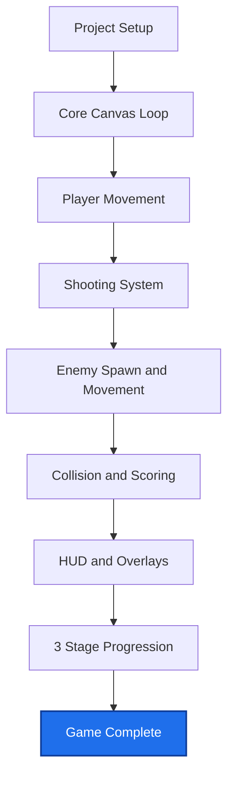

Arcade Hub — 3-Stage Space Shooter

This project is now a complete browser game demo with:

- Start menu and in-game HUD
- Player movement and shooting
- Enemy spawning and collisions
- Score, lives, and game over flow
- 3-stage progression with stage-complete transitions

## Project Completion Graph



## Files

- `index.html`
- `styles.css`
- `script.js`
- `assets/placeholder.svg`

## Quick Start

1. Open `index.html` directly in your browser.

2. Or run a local server from this folder:

```bash
python -m http.server 8000
```

Then open `http://localhost:8000`.

## Controls

- Move: Left Arrow / Right Arrow
- Shoot: Space

## Current Status

- Project state: Complete playable demo
- Git: Local repository initialized and committed